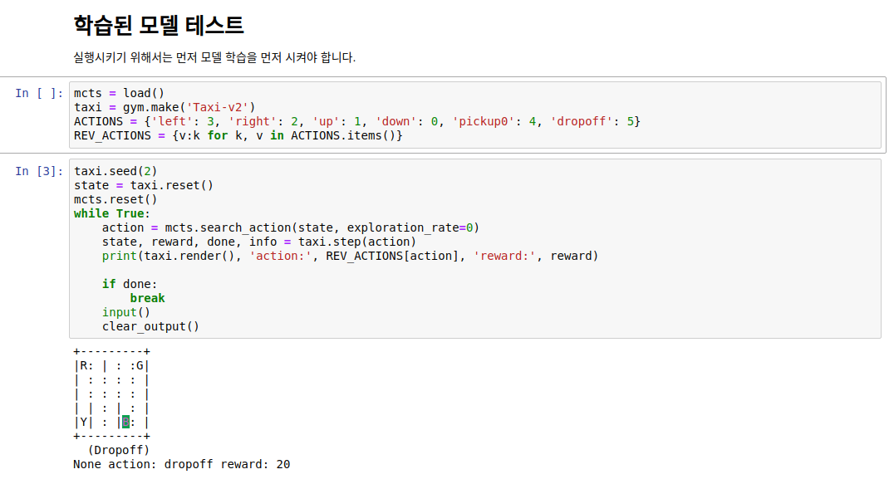

# Introduction

The repository demonstrates how MonteCarlo Tree Search Algorithm works. 

MCTS solves OpenAI's Taxi Game. 

I have not taught the MCTS how to move the taxi, where the passenger is, and where the destination is. 

All I just informed is score. 

If the taxi picked up the wrong person, it will receive negative score. 

If the taxi picked up the right passenger, it will receive positive score. 


Montecarlo tree search의 예제를 보여줍니다. 

데모로서 OpenAI의 택시문제를 풉니다. 

어떻게 움직여야 하는지, 승객이 어디 있는지, 목적지가 어디인지 아무것도 가르쳐주지 않습니다. 

단순히 목적지에 데려다주면 점수를 받고, 잘못된 승객을 태우면 점수를 잃도록 만들었습니다. 

# Result


택시 (노란색)는 승객 (파란색 R)을 탑승시킨뒤에 목적지 (핑크색 B)에 내리면 점수를 얻습니다. 

The objective of this game is that the taxi (yellow box) picks up the right person to the destination where the taxi should drop off the passenger. 

# Requirements

* Python 3.x
* OpenAI gym
* Numpy
* tqdm


# Training

```
python mcts.py
```

the following screen is an actual training logs. 

It takes quite a lot of time because of the complexity of the game. 

```
  0%|                      | 49718/10000000 [00:10<38:17, 4330.84it/s]
  1%|▏                     | 99940/10000000 [00:23<42:33, 3876.39it/s]
  1%|▎                    | 149790/10000000 [00:36<41:11, 3985.44it/s]
  2%|▍                    | 199964/10000000 [00:48<39:07, 4174.25it/s]
  2%|▌                    | 249746/10000000 [01:00<39:28, 4116.75it/s]
  3%|▋                    | 299968/10000000 [01:13<40:19, 4009.35it/s]
  3%|▋                    | 349718/10000000 [01:26<43:10, 3725.74it/s]
  4%|▊                    | 399874/10000000 [01:39<39:39, 4033.70it/s]
  4%|▉                    | 449691/10000000 [01:52<40:40, 3912.48it/s]
  5%|█                    | 499850/10000000 [02:05<42:14, 3748.36it/s]
  5%|█▏                   | 549788/10000000 [02:18<40:42, 3869.50it/s]
  6%|█▎                   | 599846/10000000 [02:32<42:58, 3646.10it/s]
  6%|█▎                   | 649833/10000000 [02:46<41:54, 3718.33it/s]
  7%|█▍                   | 699725/10000000 [03:00<45:35, 3399.51it/s]
  7%|█▌                   | 749674/10000000 [03:13<42:02, 3666.88it/s]
  8%|█▋                   | 799708/10000000 [03:27<40:32, 3782.41it/s]
  8%|█▊                   | 849691/10000000 [03:41<38:55, 3918.31it/s]
  9%|█▉                   | 899879/10000000 [03:55<41:08, 3686.03it/s]
  9%|█▉                   | 949993/10000000 [04:09<38:41, 3898.84it/s]
 10%|██                   | 999756/10000000 [04:23<38:33, 3889.65it/s]
 10%|██                  | 1049619/10000000 [04:36<41:24, 3602.29it/s]
 11%|██▏                 | 1099889/10000000 [04:50<38:16, 3874.71it/s]
 11%|██▎                 | 1149919/10000000 [05:04<38:05, 3872.58it/s]
 12%|██▍                 | 1199858/10000000 [05:18<39:36, 3703.08it/s]
 12%|██▍                 | 1249804/10000000 [05:32<40:26, 3605.91it/s]
 13%|██▌                 | 1299694/10000000 [05:46<39:45, 3647.50it/s]
 13%|██▋                 | 1349982/10000000 [05:59<37:29, 3846.12it/s]
 14%|██▊                 | 1399585/10000000 [06:12<36:13, 3957.12it/s]
 14%|██▉                 | 1449631/10000000 [06:27<38:52, 3666.31it/s]
 15%|██▉                 | 1499719/10000000 [06:41<41:44, 3394.58it/s]
 15%|███                 | 1549783/10000000 [06:56<37:48, 3725.48it/s]
 16%|███▏                | 1599677/10000000 [07:10<36:09, 3872.56it/s]
 16%|███▎                | 1649739/10000000 [07:25<42:25, 3280.04it/s]
 17%|███▍                | 1699983/10000000 [07:40<40:12, 3440.47it/s]
 17%|███▍                | 1749657/10000000 [07:54<37:27, 3670.84it/s]
 18%|███▌                | 1799954/10000000 [08:09<36:23, 3755.44it/s]
 18%|███▋                | 1849810/10000000 [08:24<37:58, 3576.76it/s]
 19%|███▊                | 1899831/10000000 [08:38<35:21, 3817.86it/s]
 19%|███▉                | 1949888/10000000 [08:53<39:25, 3402.93it/s]
 20%|███▉                | 1999749/10000000 [09:08<35:03, 3803.90it/s]
 20%|████                | 2049918/10000000 [09:22<35:18, 3752.05it/s]
 21%|████▏               | 2099931/10000000 [09:37<37:41, 3492.93it/s]
 21%|████▎               | 2149665/10000000 [09:52<34:35, 3783.29it/s]
 22%|████▍               | 2199929/10000000 [10:07<33:31, 3877.80it/s]
 22%|████▍               | 2249823/10000000 [10:22<35:02, 3686.90it/s]
 23%|████▌               | 2299622/10000000 [10:36<35:11, 3646.43it/s]
 23%|████▋               | 2349954/10000000 [10:52<37:43, 3380.20it/s]
 24%|████▊               | 2399899/10000000 [11:06<30:21, 4171.99it/s]
 24%|████▉               | 2449889/10000000 [11:21<33:41, 3735.61it/s]
 25%|████▉               | 2499851/10000000 [11:36<32:15, 3874.91it/s]
 25%|█████               | 2549793/10000000 [11:51<31:28, 3945.01it/s]
 26%|█████▏              | 2599745/10000000 [12:06<36:49, 3349.22it/s]
 26%|█████▎              | 2649967/10000000 [12:21<33:11, 3690.20it/s]
 27%|█████▍              | 2699744/10000000 [12:36<32:10, 3780.58it/s]
 27%|█████▍              | 2749723/10000000 [12:51<33:49, 3571.95it/s]
 28%|█████▌              | 2799720/10000000 [13:06<33:01, 3634.66it/s]
 28%|█████▋              | 2849724/10000000 [13:21<30:43, 3878.70it/s]
 29%|█████▊              | 2899950/10000000 [13:37<33:06, 3573.29it/s]
 29%|█████▉              | 2949621/10000000 [13:52<32:29, 3616.45it/s]
 30%|█████▉              | 2999704/10000000 [14:07<30:03, 3881.34it/s]
 30%|██████              | 3049942/10000000 [14:22<27:12, 4256.41it/s]
 31%|██████▏             | 3099754/10000000 [14:38<30:14, 3802.83it/s]
 31%|██████▎             | 3149724/10000000 [14:54<32:22, 3525.94it/s]
 32%|██████▍             | 3199807/10000000 [15:11<37:46, 3000.68it/s]
 32%|██████▍             | 3249821/10000000 [15:26<30:23, 3701.17it/s]
 33%|██████▌             | 3299932/10000000 [15:42<30:32, 3656.89it/s]
 33%|██████▋             | 3349971/10000000 [15:58<33:19, 3326.00it/s]
 34%|██████▊             | 3399921/10000000 [16:13<31:40, 3473.09it/s]
 34%|██████▉             | 3449634/10000000 [16:29<29:01, 3761.62it/s]
 35%|██████▉             | 3499994/10000000 [16:44<35:57, 3013.37it/s]
 35%|███████             | 3549995/10000000 [16:59<26:42, 4025.30it/s]
 36%|███████▏            | 3599920/10000000 [17:15<31:11, 3420.29it/s]
 36%|███████▎            | 3649971/10000000 [17:31<31:37, 3346.30it/s]
 37%|███████▍            | 3699615/10000000 [17:47<28:07, 3733.26it/s]
 37%|███████▍            | 3749996/10000000 [18:03<28:28, 3659.25it/s]
 38%|███████▌            | 3799725/10000000 [18:19<31:09, 3316.11it/s]
 38%|███████▋            | 3849756/10000000 [18:35<33:44, 3037.53it/s]
 39%|███████▊            | 3899663/10000000 [18:52<29:48, 3409.96it/s]
 39%|███████▉            | 3949966/10000000 [19:08<28:46, 3504.37it/s]
 40%|███████▉            | 3999982/10000000 [19:24<31:53, 3134.92it/s]
 40%|████████            | 4049961/10000000 [19:40<27:47, 3567.50it/s]
 41%|████████▏           | 4099944/10000000 [19:56<28:36, 3438.13it/s]
 41%|████████▎           | 4149802/10000000 [20:12<26:42, 3650.96it/s]
 42%|████████▍           | 4199713/10000000 [20:28<24:11, 3995.27it/s]
 42%|████████▍           | 4249628/10000000 [20:43<25:04, 3820.94it/s]
 43%|████████▌           | 4299692/10000000 [21:00<25:41, 3697.70it/s]
 43%|████████▋           | 4349851/10000000 [21:16<27:46, 3389.53it/s]
 44%|████████▊           | 4399940/10000000 [21:33<26:27, 3528.10it/s]
 44%|████████▉           | 4449870/10000000 [21:50<26:31, 3486.61it/s]
 45%|████████▉           | 4499980/10000000 [22:07<24:24, 3756.45it/s]
 45%|█████████           | 4549869/10000000 [22:24<29:32, 3074.37it/s]
 46%|█████████▏          | 4599940/10000000 [22:41<25:07, 3582.08it/s]
 46%|█████████▎          | 4649929/10000000 [22:58<25:20, 3517.56it/s]
 47%|█████████▍          | 4699915/10000000 [23:15<24:47, 3563.15it/s]
 47%|█████████▍          | 4749787/10000000 [23:32<27:22, 3197.38it/s]
 48%|█████████▌          | 4799842/10000000 [23:49<29:08, 2973.88it/s]
 48%|█████████▋          | 4849978/10000000 [24:06<22:18, 3848.06it/s]
 49%|█████████▊          | 4899876/10000000 [24:22<23:44, 3580.73it/s]
 49%|█████████▉          | 4949938/10000000 [24:40<24:11, 3478.16it/s]
 50%|█████████▉          | 4999908/10000000 [24:59<25:35, 3256.41it/s]
 50%|██████████          | 5049912/10000000 [25:20<31:07, 2650.81it/s]
 51%|██████████▏         | 5099874/10000000 [25:40<26:13, 3113.22it/s]
 51%|██████████▎         | 5149988/10000000 [26:03<33:35, 2406.83it/s]
 52%|██████████▍         | 5199950/10000000 [26:31<44:05, 1814.65it/s]
 52%|█████████▍        | 5249996/10000000 [27:12<1:03:32, 1245.83it/s]
 53%|█████████▌        | 5299917/10000000 [27:54<1:02:05, 1261.74it/s]
Early Stop!
Training Successfully Done
```

# Test

You have two options for testing your trained model. 

First in command line. 

```
python3.6 test.py
```

Second is using your Jupyter Notebook. 

- open test.ipynb
- test your model



