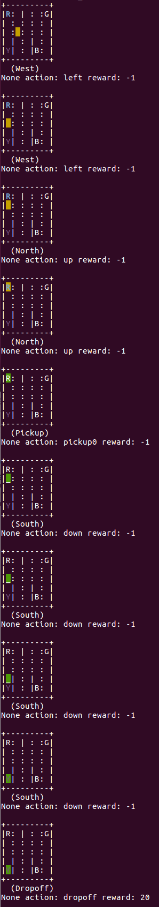

# Introduction

Monte Carlo Tree Search를 이용해서 RL문제를 해결을 합니다. 

다음의 게임을 지원합니다. 

- TicTacToe
- Othello
- Taxi


# Result

### TicTacToe


### Taxi


택시 (노란색)는 승객 (파란색 R)을 탑승시킨뒤에 목적지 (핑크색 B)에 내리면 점수를 얻습니다. 

# Requirements

* Python 3.x
* OpenAI gym
* Numpy
* tqdm


# How to Run

### TicTacToe

**Training**

```
python main.py train tictactoe
```

**Playing**

```
python main.py play tictactoe
```

### Taxi

**Training**

```
python taxi.py
```

**Playing**

```
python3.6 test.py
```

실행시키면 terminal에서 게임을 플레이 해 볼 수 있습니다.



또는 Jupyter 에서 확인해 볼 수 있습니다.
Jupyter를 실행후 test.ipynb를 열고 다음을 실행시킵니다.


